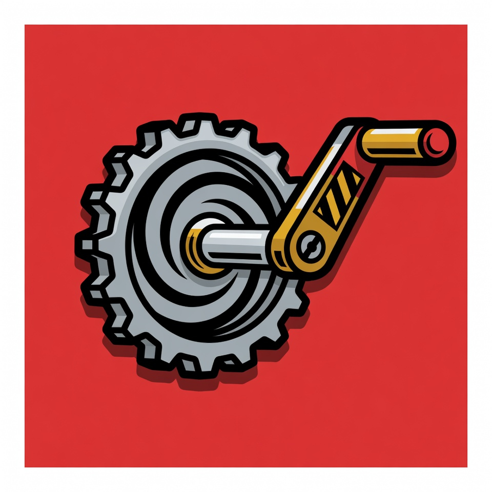

<p align="center">
  
</p>

# Crank

[](LICENSE)

`Crank.crank(machine, event)` takes a state machine struct and an event and returns a new struct. No process. No mailbox. No `start_link`. When the same logic needs timeouts and supervision, `Crank.Server` runs it as a managed process. Same module, same functions, different caller.

```
Write logic ──→ Test pure ──→ Deploy as process
                    ↑                │
                    └─ Change logic ←─┘
```

```elixir
# Pure -- tests, LiveView, Oban workers, scripts
machine = Crank.new(MyApp.VendingMachine) |> Crank.crank({:coin, 25}) |> Crank.crank({:select, "A3"})

# Process -- production, with supervision, timeouts, and telemetry
{:ok, pid} = Crank.Server.start_link(MyApp.VendingMachine, [])
Crank.Server.cast(pid, {:coin, 25})
```

Same module. Same functions. Two callers.

## The problem Crank solves

State machine logic in Erlang started as plain functions calling functions. Each state was a function. The data available in each state was whatever that function received -- nothing more. The logic was portable and testable because it was just functions.

Two things happened on the way to modern Elixir:

1. **Data scoping disappeared.** In early Erlang, `locked/2` could only see what `locked/2` was given. In a GenServer (Elixir's primary process abstraction) with `%{status: :dispensing, balance: 100, selection: nil, change: nil}`, every handler sees every field. Nothing prevents reading `change` when the status is `:dispensing`.

2. **State machine logic became inseparable from processes.** `gen_fsm` (Erlang's first formal state machine behaviour, late 1990s) coupled logic to a process. `gen_statem` (its replacement, 2016) continued that coupling. GenServer dropped state machine primitives entirely. Each step moved further from logic that could be called directly.

Crank separates the two concerns that got fused together: state machine logic and process lifecycle.

The pure core, `Crank.crank/2`, takes a struct and an event and returns a new struct. No process, no mailbox, no side effects. The process shell, `Crank.Server`, wraps the same module in `gen_statem` (Erlang's built-in state machine process) when timeouts, supervision, and telemetry are needed. Same logic, both modes.

For data scoping, Crank supports struct-per-state -- each state is its own struct with exactly the fields that exist in that state (see [Struct-per-state](#struct-per-state-making-illegal-states-unrepresentable) below). A `%Dispensing{}` struct can't have a `change` field because the field doesn't exist on that struct. The types enforce the invariants.

<details>
<summary>Historical context: how state machines evolved in Erlang and Elixir</summary>

**Plain Erlang (1980s--1990s).** State machines were mutually recursive functions. Each state was a function. When the machine transitioned, it tail-called into the next state's function:

```erlang
locked(Event, Data) ->
    case Event of
        unlock -> unlocked(Data);
        _      -> locked(Data)
    end.

unlocked(Event, Data) ->
    case Event of
        lock -> locked(Data);
        open -> opened(Data)
    end.
```

The call stack scoped the data. The logic was just functions -- callable directly without a process.

**`gen_fsm` (OTP, late 1990s).** OTP (the standard library of process patterns that ships with Erlang/Elixir) formalized this into a behaviour (an interface contract -- define specific functions, the framework calls them). Each state was still a callback function. This preserved the function-per-state model but coupled it to a process.

**`gen_statem` (OTP 19, 2016).** Replaced `gen_fsm`. Added `handle_event_function` mode -- one function handles all states, state can be any term. More flexible, but now all data is accessible regardless of which state the machine is in. Still coupled to a process.

**Elixir and GenServer (2012--present).** Most Elixir developers came from Ruby and JavaScript, not Erlang. GenServer became the primary abstraction, and GenServer has no concept of states -- just `handle_call`, `handle_cast`, `handle_info` with one blob of data. State machines were simulated with a `:status` atom and pattern matching. The function-per-state idea didn't carry over.

</details>

## How Crank compares to GenServer

José Valim's consistent advice: start simple, promote to complex when needed. Plain functions before GenServer. GenServer before `gen_statem`.

Crank's pure mode is simpler than GenServer. `Crank.crank(machine, event)` is a function call that returns a struct. No `start_link`. No mailbox. No supervision tree. No process lifecycle.

```
Pure function (Crank.crank/2) → GenServer → gen_statem (Crank.Server)
       simplest                                     most powerful
```

The promotion path is built in. Start with `Crank.crank/2` (pure, no process). Promote to `Crank.Server` (supervised `gen_statem`) when timeouts, supervision, or replies are needed. The promotion is a deployment decision, not a rewrite. Same module, same logic, different caller.

Most Elixir developers use GenServer with a `%{status: :accepting}` field and pattern match on it in their `handle_call` and `handle_cast` clauses. That IS a state machine. It's just not a formal one.

The Elixir ecosystem has spent a decade building out its infrastructure: Ecto for persistence, Phoenix for web, Oban for background jobs, Broadway for data pipelines, Bandit for HTTP. Caches, connection pools, pubsub brokers, HTTP clients -- all built, all mature, all excellent. That infrastructure exists to support one thing: the domain model (the data structures and rules that represent what a system actually does, independent of databases or web frameworks).

As the infrastructure layer matures and gets solved, what remains is the domain model. And a domain model IS states and transitions.

A customer is in a state: prospect, active, churning, dormant. A submission is in a state: received, validating, eligible, declined. A policy is in a state: quoted, bound, active, lapsed, renewed.

Business rules ARE transition rules: "can't bind without quoting first," "when the underwriter approves, move from review to eligible." The states are the domain model. The transitions are the business logic. Together, they're a state machine.

Every business rule answers one question: given this state and this event, what happens next? That's the definition of a finite state machine. The question was never whether a domain has a state machine in it. It always does. The question is whether it's explicit or implicit.

A GenServer with scattered pattern matches across `handle_call` clauses is a domain model that hides itself. A Crank module where each `handle/3` clause declares a state, an event, and a transition is a domain model that's honest about what it is. Both are state machines. One is readable.

The reason domain models got hidden inside GenServers was cost. `gen_statem` added ceremony -- callback modes, process coupling, untestable runtime integration. Crank eliminates that cost. A `handle/3` clause is no more complex than a `handle_call` with pattern matching on `state.status`. Explicit is now as cheap as implicit.

### Domain functions serve the state machine

A common objection: "My domain logic is too complex for a state machine. I have pricing engines, eligibility rules, validation pipelines."

These aren't alternatives to the state machine. They're tools it uses. A pricing engine is a function called *inside* `handle/3`:

```elixir
def handle(:calculate_premium, %Quoted{} = state, data) do
  premium = PricingEngine.calculate(data.risk_factors, data.coverage)
  {:next_state, %Quoted{state | premium: premium}, data}
end
```

The pricing engine doesn't decide what state to transition to. The state machine decides that. The pricing engine computes a value. Decision tables, eligibility rules, validation pipelines -- they all live inside `handle/3` clauses, called when the state machine determines they're relevant. The state machine is the orchestrator. Everything else is a helper.

In domain-driven design, this relationship is called an *aggregate* -- a cluster of related data and rules treated as a single unit, with one entry point controlling all changes. Outside code doesn't reach into the pricing engine directly. It sends an event to the aggregate, and the aggregate decides which internal functions to invoke based on its current state. The state machine IS the aggregate root.

### Recognizing the state machine you already have

Object-oriented code with status checks is already a state machine:

```ruby
class Policy
  def bind!
    raise "Can't bind without a quote" unless status == :quoted
    raise "Can't bind a declined policy" if status == :declined
    self.status = :bound
    notify_underwriter
  end
end
```

Every guard clause is a transition rule. Every status check is a state. Every method that changes status is an event handler. This is a state machine -- spread across methods instead of declared in one place.

When the rules are simple, it works. When there are fifteen statuses and forty methods that each check three preconditions, the implicit machine becomes unreadable. No one can answer "what are all the ways a policy reaches `:bound`?" without reading every method.

A Crank module answers that question by structure. Each `handle/3` clause declares one transition: this event, in this state, produces this outcome. The set of clauses IS the specification. It reads top to bottom like a decision table.

### Coordinating multiple state machines

When multiple state machines need to coordinate -- an order triggers payment, payment triggers fulfillment, fulfillment triggers shipping -- that coordination is itself a state machine.

In domain-driven design, this pattern is called a *saga* (sometimes called a *process manager*): a long-running coordination sequence across multiple independent state machines, where each step depends on the outcome of the previous one.

A saga has states (waiting for payment, waiting for fulfillment, waiting for shipment), events (payment succeeded, fulfillment completed, shipment confirmed), and transitions (when payment succeeds, request fulfillment). That's a Crank module.

The saga doesn't contain the business logic of payment or fulfillment. It orchestrates them. Each step sends an event to another state machine and waits for the response:

```elixir
def handle(:payment_confirmed, :awaiting_payment, data) do
  {:next_state, :awaiting_fulfillment, data, [{:next_event, :internal, :request_fulfillment}]}
end

def handle(:fulfillment_complete, :awaiting_fulfillment, data) do
  {:next_state, :awaiting_shipment, data}
end
```

State machines all the way down. The domain objects are state machines. The coordination between them is a state machine. The pattern scales because the abstraction is the same at every level.

### What the process adds

Crank.Server adds what pure functions can't provide:

**State-dependent timeouts.** "If the machine is in `:dispensing`, fire a jam timeout after 5 seconds. If it's in `:accepting`, fire an inactivity timeout after 60 seconds." GenServer has one timeout mechanism. `gen_statem` has per-state timeouts.

**State enter callbacks.** "Every time the machine enters `:dispensing`, emit telemetry and log it." GenServer doesn't have enter callbacks.

**Effect inspection.** When a callback returns `[{:state_timeout, 5_000, :jam_timeout}]`, pure code stores it in `machine.effects` as inert data. Tests can assert on exactly what effects a transition *would* produce without executing them. `gen_statem` executes effects immediately -- there's no way to inspect intent separately from execution.

**Pure testing at scale.** Crank's test suite runs 26 properties at 10,000 iterations each -- roughly 100 million random event sequences in ~20 seconds. No `start_link`/`stop` per iteration. Pure functions compose with StreamData trivially; processes don't.

## Pure mode vs. process mode

One callback module works in both modes. `Crank.crank/2` calls the callbacks directly as a pure function. `Crank.Server` calls the same callbacks through `gen_statem`. There's nothing to switch on or off.

| | Pure | Process |
|---|---|---|
| **API** | `Crank.new/2` + `Crank.crank/2` | `Crank.Server.start_link/3` |
| **Returns** | A `%Crank.Machine{}` struct | A supervised `gen_statem` process |
| **Side effects** | None -- effects stored as inert data | Executed by `gen_statem` |
| **Telemetry** | None | `[:crank, :transition]` on every state change |
| **Good for** | Tests, LiveView reducers, Oban workers, scripts | Production supervision, timeouts, replies |

The development workflow: write the logic, test it purely with property tests (millions of random event sequences), deploy it as a supervised process. When a state or transition changes, change the callback module and rerun the property tests. If they pass, the process version works too -- it's the same code. The only difference is who calls the functions and what happens to the effects afterward.

## Quick start

Define a state machine by implementing the `Crank` behaviour (an interface contract -- define specific functions, Crank calls them):

```elixir
defmodule MyApp.VendingMachine do
  use Crank

  @impl true
  def init(opts), do: {:ok, :idle, %{price: opts[:price] || 100, balance: 0, stock: 10}}

  @impl true
  def handle({:coin, amount}, :idle, data) do
    {:next_state, :accepting, %{data | balance: amount}}
  end

  def handle({:coin, amount}, :accepting, data) do
    {:next_state, :accepting, %{data | balance: data.balance + amount}}
  end

  def handle({:select, _item}, :accepting, %{balance: bal, price: price} = data)
      when bal >= price do
    {:next_state, :dispensing, data, [{:state_timeout, 5_000, :jam_timeout}]}
  end

  def handle(:dispensed, :dispensing, %{balance: bal, price: price} = data) do
    remaining = data.stock - 1
    change = bal - price

    cond do
      change > 0 ->
        {:next_state, :making_change, %{data | stock: remaining, balance: change}}
      remaining == 0 ->
        {:next_state, :out_of_stock, %{data | stock: 0, balance: 0}}
      true ->
        {:next_state, :idle, %{data | stock: remaining, balance: 0}}
    end
  end

  def handle(:change_returned, :making_change, data) do
    if data.stock == 0 do
      {:next_state, :out_of_stock, %{data | balance: 0}}
    else
      {:next_state, :idle, %{data | balance: 0}}
    end
  end

  def handle(:restock, :out_of_stock, data) do
    {:next_state, :idle, %{data | stock: 10}}
  end

  def handle(:cancel, :accepting, data) do
    {:next_state, :making_change, data}
  end
end
```

### Pure usage

No process, no setup, no cleanup:

```elixir
machine =
  MyApp.VendingMachine
  |> Crank.new(price: 75)
  |> Crank.crank({:coin, 25})
  |> Crank.crank({:coin, 50})
  |> Crank.crank({:select, "A3"})

machine.state   #=> :dispensing
machine.effects #=> [{:state_timeout, 5_000, :jam_timeout}]
```

### Process usage

Full OTP supervision and `gen_statem` power:

```elixir
{:ok, pid} = Crank.Server.start_link(MyApp.VendingMachine, price: 75)
Crank.Server.cast(pid, {:coin, 25})
Crank.Server.call(pid, :status)  # when there's a {:call, from} clause
```

### Callback signature

The primary callback is `handle/3`. Crank calls it every time an event arrives, passing the event, the current state, and the accumulated data. It returns the next state:

```elixir
def handle(event, state, data)
```

| Argument | What it is |
|---|---|
| `event` | The event payload |
| `state` | Current state |
| `data` | Accumulated machine data |

```elixir
def handle({:coin, amount}, :accepting, data) do
  {:next_state, :accepting, %{data | balance: data.balance + amount}}
end
```

When the function needs the event type (to send replies, distinguish timeouts, or handle raw process messages), use `handle_event/4`. It matches `gen_statem`'s `handle_event_function` callback mode exactly:

```elixir
def handle_event(event_type, event_content, state, data)
```

| `event_type` | `:internal`, `:cast`, `{:call, from}`, `:info`, `:timeout`, `:state_timeout`, `{:timeout, name}` |
|---|---|

If a module exports `handle_event/4`, Crank uses it instead of `handle/3`. For mixed usage, add a catch-all delegation:

```elixir
# Server-only: reply to synchronous calls
def handle_event({:call, from}, :status, state, data) do
  {:keep_state, data, [{:reply, from, state}]}
end

# Everything else delegates to handle/3
def handle_event(_, event, state, data), do: handle(event, state, data)
```

### Return values

Every `handle/3` clause returns a tuple that tells Crank what to do next:

- `{:next_state, new_state, new_data}` -- move to a different state
- `{:next_state, new_state, new_data, actions}` -- move and declare side effects
- `{:keep_state, new_data}` -- stay in the same state, update the data
- `{:keep_state, new_data, actions}` -- stay and declare side effects
- `:keep_state_and_data` -- nothing changes
- `{:keep_state_and_data, actions}` -- nothing changes but declare side effects
- `{:stop, reason, new_data}` -- shut down the machine

These match `gen_statem`'s return values exactly.

### Effects as data

When a callback returns actions (timeouts, replies, postpone), the pure core stores them in `machine.effects` as inert data. It never executes them. `Crank.Server` executes them via `gen_statem`.

```elixir
def handle({:select, _item}, :accepting, %{balance: bal, price: price} = data)
    when bal >= price do
  {:next_state, :dispensing, data, [{:state_timeout, 5_000, :jam_timeout}]}
end
```

```elixir
machine = Crank.crank(machine, {:select, "A3"})
machine.effects
#=> [{:state_timeout, 5_000, :jam_timeout}]
```

Each `crank/2` call replaces `effects`. They don't accumulate across pipeline stages.

### Enter callbacks

Optional. Crank calls `on_enter/3` after a state change, passing the old state, the new state, and the data:

```elixir
@impl true
def on_enter(_old_state, _new_state, data) do
  {:keep_state, Map.put(data, :transitioned_at, System.monotonic_time())}
end
```

### Stopped machines

`{:stop, reason, data}` sets `machine.status` to `{:stopped, reason}`. Further cranks raise `Crank.StoppedError`. Use `crank!/2` in tests to raise immediately on stop results.

### Unhandled events

No catch-all. Unhandled events crash with `FunctionClauseError`. This is deliberate -- a state machine that silently ignores events is hiding bugs. Let it crash; let the supervisor handle it.

## Telemetry

`Crank.Server` emits a `[:crank, :transition]` event on every state change. Telemetry (Erlang's standard library for emitting observable events from running code) lets adapters react to transitions without the domain model knowing they exist:

```elixir
%{
  module: MyApp.VendingMachine,
  from: :idle,             # nil on initial enter
  to: :accepting,
  event: {:coin, 25},      # nil on enter
  data: %{price: 75, balance: 25, stock: 10}
}
```

Attach handlers for persistence, notifications, audit logging, PubSub -- see the [Hexagonal Architecture guide](guides/hexagonal-architecture.md) for patterns.

## Struct-per-state: making illegal states unrepresentable

The standard Elixir approach uses one struct with a `:status` atom and every field present in every state:

```elixir
%VendingMachine{status: :dispensing, balance: 100, selection: "A3", change: nil, error: nil}
# change shouldn't exist here. error shouldn't exist here.
# But nothing prevents it.
```

This is what domain-driven design calls an *anemic domain model* -- the shape doesn't encode the rules. Any field is accessible in any state.

Crank supports an alternative: each state is its own struct. The struct defines exactly what data exists in that state. No optional fields, no "only set when the state is X" comments:

```elixir
defmodule Idle,         do: defstruct []
defmodule Accepting,    do: defstruct [:balance]
defmodule Dispensing,   do: defstruct [:balance, :selection]
defmodule MakingChange, do: defstruct [:change]
defmodule OutOfStock,   do: defstruct []
```

This works because `Crank.Machine.state` is `term()` -- atoms, structs, tagged tuples all work. Pattern matching on the struct type gives the state and its data in one destructure:

```elixir
def handle({:select, item}, %Accepting{balance: bal}, data) when bal >= data.price do
  {:next_state, %Dispensing{balance: bal, selection: item}, data}
end
```

State-specific data lives in the struct. Cross-cutting concerns (price, stock count, machine location) live in `data`. When a field changes on the current state struct, use `{:next_state, %SameType{updated}, data}` -- the state value changed, so it's a transition. `:keep_state` is reserved for `data`-only changes.

The type annotations are written for Elixir's set-theoretic type system (introduced in v1.17), which lets the compiler reason about union types and warn when a function doesn't handle all variants:

```elixir
@type state :: Idle.t() | Accepting.t() | Dispensing.t() | MakingChange.t() | OutOfStock.t()
```

When the compiler can check this (expected mid-2026+), unhandled state variants will produce compiler warnings with zero code changes. Until then, property tests enforce the same guarantee dynamically -- see `Crank.Examples.Submission` for the full example.

## Design principles

- **Pure core, effectful shell.** Domain logic is pure data transformation. Side effects live at the boundary. This is [hexagonal architecture](guides/hexagonal-architecture.md) by construction, not by convention.
- **No magic.** Crank passes `gen_statem` types and return values through unchanged. Learning `gen_statem` is learning Crank.
- **No hidden state.** No `states/0` callback, no registered names, no catch-all defaults. Function clauses declare the machine.
- **Let it crash.** Unhandled events are bugs. Crank surfaces them immediately.
- **Auditable.** ~400 lines. Every line of Crank can be read in one sitting and verified. No framework, just a library.

See [DESIGN.md](DESIGN.md) for the full specification and rationale behind every decision.

## Installation

```elixir
def deps do
  [
    {:crank, "~> 0.2.0"}
  ]
end
```

## Documentation

- [DESIGN.md](DESIGN.md) -- Full specification and design rationale
- [Hexagonal Architecture guide](guides/hexagonal-architecture.md) -- Integration patterns for persistence, notifications, and audit logging
- [CHANGELOG.md](CHANGELOG.md) -- Version history

## License

MIT
